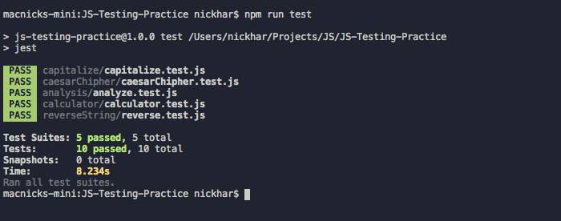

# Javascript Testing

> Practice testing javascript functions using jest testing framework.

Additional description about the project and its features.

## Built With

- Javascript ES6,
- jest

## Getting Started

To get a local copy up and running follow these simple steps.

1. `git clone https://github.com/macnick/JS-Testing-Practice.git`
2. `cd JS-Testing-Practice`
3. `npm i`
4. `npm run test`

### Prerequisites

1. Node installation

### Run tests

1. `npm run test`

## Authors

👤 **Author1**

- Github: [@addod19](https://github.com/addod19)
- Twitter: [@DanielLarbiAdd1](https://twitter.com/DanielLarbiAdd1)
- Linkedin: [Daniel Larbi Addo](https://linkedin.com/in/daniel-larbi-addo-9738b0128/)
- Email: [Daniel Larbi Addo](addodaniellarbi@gmail.com)

👤 **Author2**

- Github: [@macnick](https://github.com/macnick)
- Twitter: [@mac_experts](https://twitter.com/mac_experts)
- Linkedin: [Nick Haralampopoulos](https://www.linkedin.com/in/nick-haralampopoulos/)
- Email: [Nick Haralampopoulos](mac.expert.nick@gmail.com)

## 🤝 Contributing

Contributions, issues and feature requests are welcome!

Feel free to check the [issues page](issues/).

## Show your support

Give a ⭐️ if you like this project!

## Acknowledgments

- Microverse for giving us the opportunity
- Out great TSE for the review

## 📝 License

This project is [MIT](LICENSE) licensed.
